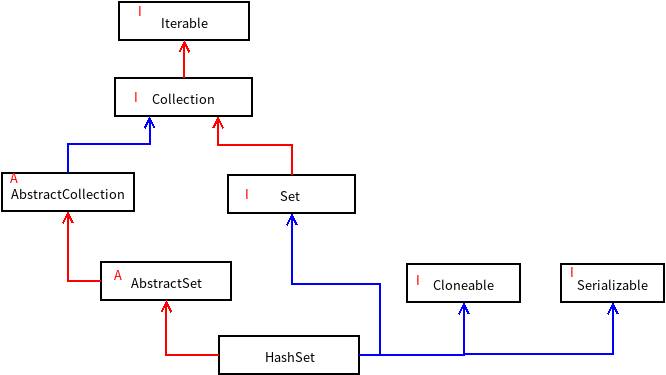

## HashSet源码解读

1. HashSet是Set集合的一个实现类，Set集合的特点是无序、不可重复。*这儿说的无序是说Set集合里的元素的顺序跟我们存入的顺序是不一样的，所以无序，并不是元素的顺序可以任意颠倒。事实上，Set集合的和后面要说的HashMap的Key是一样的，跟存入的顺序无关，但是内部会根据hashCode来进行排序。*

   先来看一下HashSet继承和实现的类有哪些吧，其中红色的线代表继承关系，蓝色的线代表实现关系，A表示这是一个抽象类，I表示这是一个接口

   

2. Set接口

   由于它是无序的，所以相比List集合少了很多的关于索引的操作，Set接口中声明了几个重要的方法：equals(),clear(),remove(),add(),toArray(),contains(),size()等

3. HashSet类

   其他的就不多介绍了，直接看HashSet类。

   - 先看看定义的成员变量

     ```java
     static final long serialVersionUID = -5024744406713321676L;
     private transient HashMap<E,Object> map;
     // Dummy value to associate with an Object in the backing Map
     private static final Object PRESENT = new Object();
     ```

     从这儿我们可以知道，HashSet其实是用Map实现的，具体来说是HashMap()，毕竟Map的实现类也不止一个HashMap，扯远了。那么这个PRESENT是什么呢？Map的特点是键值对，键是不可重复的，Set不是键值对，都是单一的元素，所以说，Set中的元素其实就是HashMap中的Key。既然要用HashMap来实现，那么Key有了，Value就是PRESENT，因为我们可以不关心Value的值，所以直接定义为一个Object对象。

   - 构造方法

     这里面的构造方法比较多，原理都差不多，就是构造一个HashMap，然后我们在使用Set的方法，比如add，remove，这些方法的时候，只需要操作HashMap中的Key就可以了。

     ```java
     /**
          * Constructs a new, empty set; the backing <tt>HashMap</tt> instance has
          * default initial capacity (16) and load factor (0.75).
          */
     public HashSet() {
         map = new HashMap<>();
     }
     
     public HashSet(Collection<? extends E> c) {
         map = new HashMap<>(Math.max((int) (c.size()/.75f) + 1, 16));
         addAll(c);
     }
     
     /**
          * Constructs a new, empty set; the backing <tt>HashMap</tt> instance has
          * the specified initial capacity and the specified load factor.
          */
     public HashSet(int initialCapacity, float loadFactor) {
         map = new HashMap<>(initialCapacity, loadFactor);
     }
     
     /**
          * Constructs a new, empty set; the backing <tt>HashMap</tt> instance has
          * the specified initial capacity and default load factor (0.75).
          */
     public HashSet(int initialCapacity) {
         map = new HashMap<>(initialCapacity);
     }
     
     /**
          * Constructs a new, empty linked hash set.  (This package private
          * constructor is only used by LinkedHashSet.) The backing
          * HashMap instance is a LinkedHashMap with the specified initial
          * capacity and the specified load factor.
          */
     HashSet(int initialCapacity, float loadFactor, boolean dummy) {
         map = new LinkedHashMap<>(initialCapacity, loadFactor);
     }
     ```

     这些构造方法就是HashMap的构造方法，可以去我的另一篇文章中看[关于HashMap实现](./HashMap.md)，理解了HashMap，那么HashSet就没问题了。下面放一些HashSet的方法来感受以下就可以了

   - HashSet常用方法

     ```java 
     // 迭代，其实就是对HashMap的Key的迭代
     public Iterator<E> iterator() {
         return map.keySet().iterator();
     }
     
     // 返回Set集合的元素个数
     public int size() {
         return map.size();
     }
     
     public boolean isEmpty() {
         return map.isEmpty();
     }
     
     // 判断Set集合中是否包含元素o
     public boolean contains(Object o) {
         return map.containsKey(o);
     }
     
     // 向集合中增加元素
     public boolean add(E e) {
         return map.put(e, PRESENT)==null;
     }
     
     // 删除集合中的元素o，如果元素不存在，返回false
     public boolean remove(Object o) {
         return map.remove(o)==PRESENT;
     }
     
     public void clear() {
         map.clear();
     }
     
     ```

4. 总结

   HashSet的底层就是用HashMap实现的，特点是无序，不可重复。因为无序，所以不能用索引来操作该集合，对集合的遍历一般只能用迭代器或者for-each。