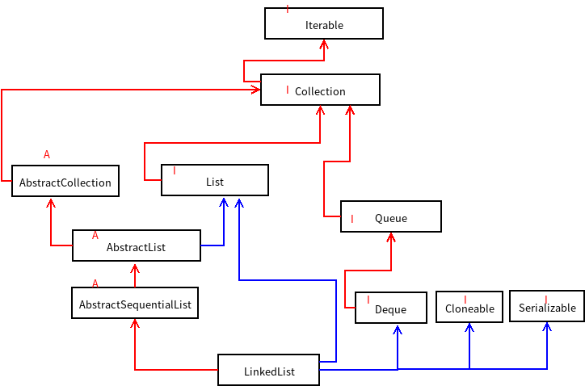

## LinkedList分析

1. 下面是LinkedList所继承和实现的父类的关系图

   图中，红色的线代表的是继承关系，蓝色的线代表实现关系，方框标明红色A的表示是抽象类，红色I的表示是接口。



2. Iterable(Interface))

   这个接口的意思是可迭代，也就是说，实现该接口的类都是可以迭代的。

3. Collection(Interface)

   这是集合的父类，我们熟知的Set和List都是这个Collection接口的子接口。

   该接口中定义了一些集合共有的方法

   比如: size(), isEmpty(), contains(Object o), iterator(),add(),remove(Object o),clear(),equals(Object o)等方法，具体各个方法的意思是什么，应该不用说了。

4. Queue(Interface)

   该接口描述的是队列，队列是一种先进先出的数据结构，所以它对应操作有入队，出队。

   它里面声明了几个方法：

   入队：add(), offer()

   出队：remove(), poll()

   获取队列的第一个元素：element(), peek()

   以上方法都是对应队列中的一些实现逻辑

 5. Deque(Interface)

    该接口是Queue接口的一个子接口，主要是用来描述双端队列的，当然，我们在实现栈的时候，其实也与这个接口有关。

    既然是要描述双端队列，那么就是说两边都可以对元素进行操作了。

    所以它除了有Queue接口中方法，还增加了一些操作“双端”的方法

    比如：addFirst(), addLast(), offerFirst(),offerLast(),iterator()等，这些方法从名字上就知道是什么意思了，也正是这些方法才实现了双端操作元素，iterator方法也说明了我们在实现队列和栈时可以迭代

    当然，对于操作栈，还有两个我们在数据结构中熟悉的方法名：push()和pop()，入栈和出栈。

6. List(Interface)

   List接口直接继承了Collection接口，这个集合的常用实现类就是ArrayList和LinkedList，而且是一个有序、可重复的集合。所以里面增加了一些方法。

   比如：get(),set(),indexOf(),lastIndexOf(),subList()等方法。

7. AbstractCollection,AbstractList,AbstractSequentialList(abstract)

   这三个都是抽象类，其中实现了部分Collection和List中的抽象方法。

8. LinkedList

   LinkedList是一个实现类，其内部是用一个双向链表实现该集合的功能。内部维护了一个first和last结点，这样就可以方便的操作集合了。

   该结点是LinkedList的内部类，下面是该内部类的源码

   ```java
   private static class Node<E> {
       E item;
       Node<E> next;
       Node<E> prev;
   
       Node(Node<E> prev, E element, Node<E> next) {
           this.item = element;
           this.next = next;
           this.prev = prev;
       }
   }
   ```

   这个双向链表就是该集合的核心之一。

   接下来看看其中的一些方法吧

   针对链表的操作无非就是元素的插入，删除。其中的插入又有三种情况，即从头结点、指定位置、尾部插入，删除同理。

   ```java
   public boolean add(E e) {
       linkLast(e);
       return true;
   }
   ```

   我们直接看其中的几个是如何实现的吧

   - 增加元素

     ```java
     public boolean add(E e) {
         linkLast(e);
         return true;
     }
     
     /**
          * Links e as last element.
          */
     void linkLast(E e) {
         final Node<E> l = last;
         final Node<E> newNode = new Node<>(l, e, null);
         last = newNode;
         if (l == null)
             first = newNode;
         else
             l.next = newNode;
         size++;
         modCount++;
     }
     ```

     队列和栈对应的入队操作（就是就是在链表的最后增加一个新的结点），其实也是调用上面这个方法

     ```java
     public boolean offer(E e) {
         return add(e);
     }
     
     public void push(E e) {
         addFirst(e);
     }
     ```

   - 删除元素

     ```java
     public E remove() {
         return removeFirst();
     }
     
     public E removeFirst() {
         final Node<E> f = first;
         if (f == null)
             throw new NoSuchElementException();
         return unlinkFirst(f);
     }
     
     /**
          * Unlinks non-null first node f.
          */
     private E unlinkFirst(Node<E> f) {
         // assert f == first && f != null;
         final E element = f.item;
         final Node<E> next = f.next;
         f.item = null;
         f.next = null; // help GC
         first = next;
         if (next == null)
             last = null;
         else
             next.prev = null;
         size--;
         modCount++;
         return element;
     }
     ```

     因为队列先进先出的，所以出队就是删除头元素

     ```java
     public E poll() {
         final Node<E> f = first;
         return (f == null) ? null : unlinkFirst(f);
     }
     ```

     栈是先进后出，所以出栈实际上是删除最后一个元素

     ```java
     public E pop() {
         return removeFirst();
     }
     ```

 9. 总结

      LinkedList底层使用双向链表实现的，这个类中维护了一个first（头结点），last（最后一个结点），size（链表的长度），还有一个modCount（链表被操作的次数），这个modCount我们暂时用不到，只要理解了双向链表，那么集合框架中的LinkedList就没有难度了。

   

   

   

   

   

   

   

   

   

   

   

   

   

   

   

   

   

   

   

   

   

   

   

   

   

   

   

   

   

   

   