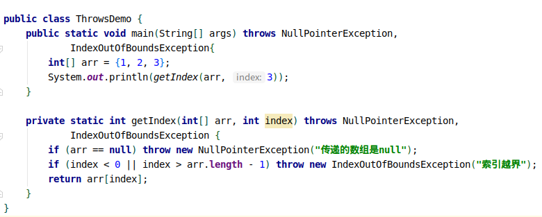
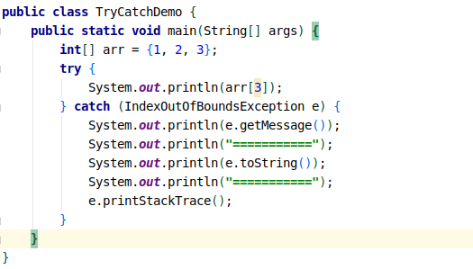
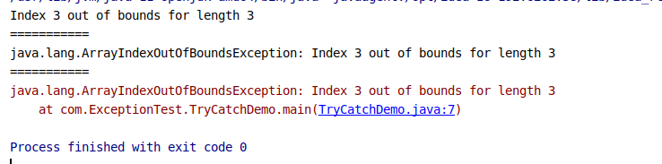
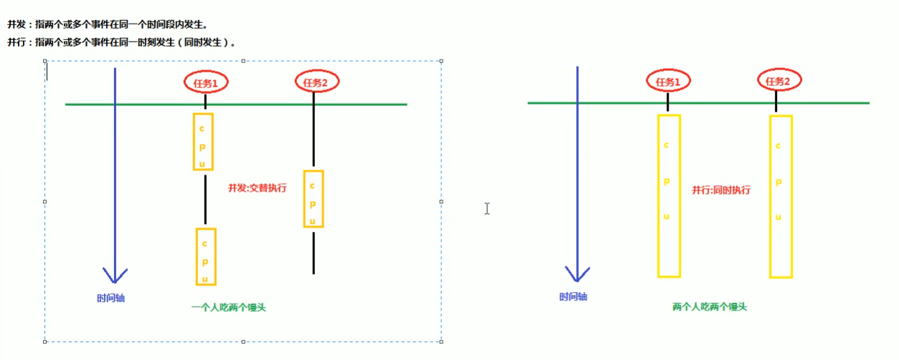
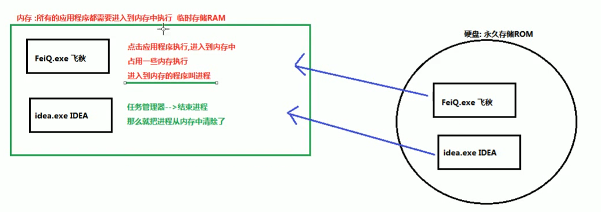
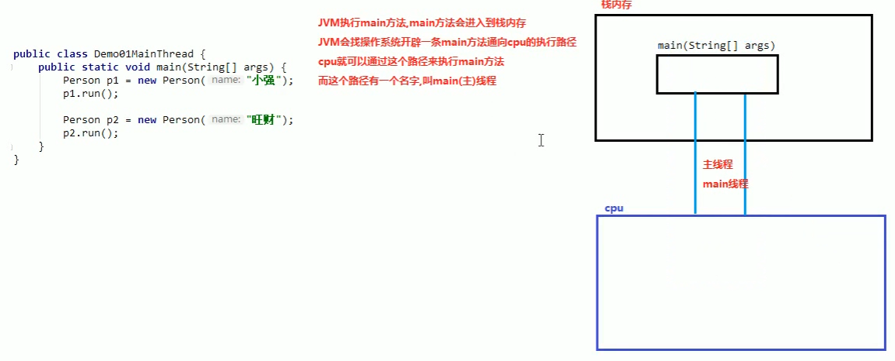
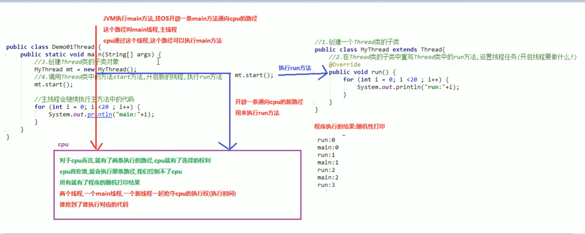
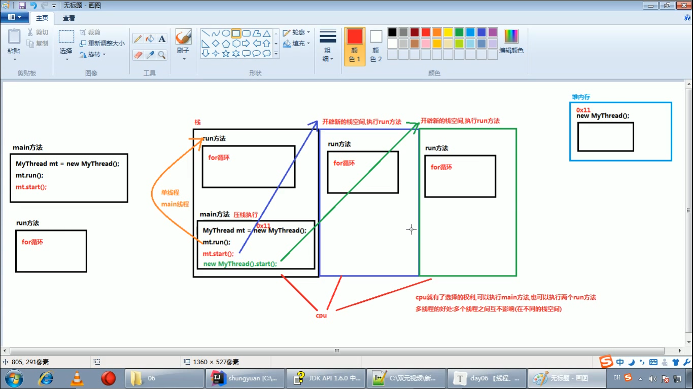
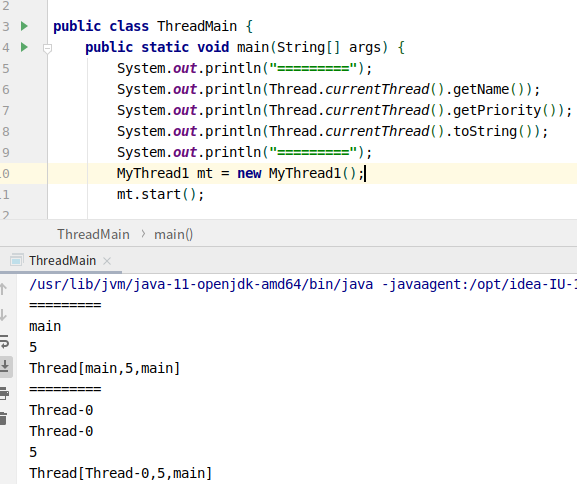

[TOC]

### 集合

#### 1. Map

> Map的key必须是唯一的，如果重复了，那么后面put的值会覆盖之前的值

##### 1.1 创建一个HashMap对象

> HashMap<Object, Object> map = new HashMap<>();

##### 1.2 常用方法

> - 添加键值对：V put(K key, V value);
>
>   - 查看是否为空：boolean isEmpty();
>
> - 查看长度：int size();
>   
>- 删除元素：V remove (Object key);
> 
>- 查看key或value是否已经存在：boolean containsKey(Object key);　boolean containsValue(Object value);
>   
> - 得到所有key或value对应的集合：Set<K> keySet();　Collection<V> values();
> 
> - 查看key对应的value：V get(Object key);

##### 1.3 HashMap的遍历

```java
for (int key : map.keySet()) {
    System.out.println(key + ": " + map.get(key));
}
```


### 异常及处理

#### 1. throw关键字

> 抛出指定的异常。
>
> - 格式：`throw new XxxException("产生异常的原因");`
>
>   > **注意**:
>   >
>   > - throw关键字必须写在方法的内部
>   >
>   > - XxxException必须是Exception或者它的子类
>   >
>   > - throw抛出了异常，那么就必须要处理异常
>   >
>   >   > - 如果异常是RuntimeException类或者它的子类，那就不用处理，默认交给JVM处理
>   >   >
>   >   > - 否则必须用throws或者try...catch...处理

#### 2. Objects非空判断

> 在检验参数是否为空时，可以使用下面的方法
>
> `Objects.requireNonNull(obj)`，该方法的源码。
>
> 
>
> 例如
>
> ```java
> int getIndex(int[] arr, index) {
>     Objects.requireNonNull(arr, "传递的数组是null");
>     Objects.requireNonNull(index);
> }
> ```

#### 3. throws关键字

> 这是处理异常的第一种方法：交给别人处理
>
> - 作用：使用throws声明异常，然后交给该方法的调用者，最后交给JVM--中断处理
>
> - 使用格式：
>
> ```java
> 修饰符　返回值类型　方法名(参数列表)　throws XxxException, ....{
> throw new XxxException(".....");
> .....
> }
> ```
> - 注意：
>   1. throws关键字必须写在方法声明处
>   
>   2. throw关键字后边声明的异常必须是Exception或者其子类
>   
> 3. 方法内部如果抛出了多个异常异常对象，那么就要在throws后加几个异常对象。如果多个异常对象之间存在父子关系，则只需要声明父类异常
>   
>   4. 声明的异常要么是交给JVM处理，要么是自己写try...catch...处理
>   
> - 例子
>
> 
>

#### 4. try...catch...

> - 格式：
>
> ```java
> try {
> ....
> } catch (定义一个异常的变量，用来接受try中抛出的异常对象){
> ...
> }
> ```
>   - 注意：try 中可能会抛出多个异常对象，那么就要用多个catch来处理
>
>   - Throwable类中国定义了３个异常处理的方法
>
>    > 1. String getMessage()  返回此throwable的简短描述
>    > 2. String toString() 返回此throwable的详细消息字符串
>    > 3. void printStackTrace() JVM打印就是使用了该方法，信息是最多的。
>   
>   - 例如
>  
>
>   结果是　
>
> 

#### 5. finally

> 无论是否发生异常都会执行的代码块，不能单独使用，只能和try...catch搭配使用

### 多线程

#### 1. 线程实现方式

##### 1.1 并发和并行

> 

##### 1.2 进程的概念

> 

##### 1.3 多线程

> 

##### 1.4 线程调度

> - 分时调度
>
>   > 所有线程轮流使用CPU的使用权，平均分配每个线程占用CPU的时间
>
> - 抢占式调度
>
>   > 优先让优先级高的线程使用CPU，如果线程的优先级相同，那么会随机选择一个(线程随机)，Java使用的是抢占式调度
>

##### 1.5 主线程

> 

#### 2. 创建多线程的方式

##### 1.1 第一种方式

###### 1.1.1 创建Thread类的子类
> - 实现步骤：
>   1. 创建一个Thread了的子类
>   2. 在Thread类的子类中重写Thread类中的run()方法
>   3. 创建Thread类的子类对象
>   4. 调用Thread类中的start方法，开启新的线程，执行run方法
>
###### 1.1.2 多线程原理
> 
>
###### 1.1.3 多线程在内存中的表示
>   
>

###### 1.1.4 一些常用方法

> - `static Thread   currentThread()` 返回对当前正在执行的线程对象的引用。
>
> - `String getName()` 返回该线程的名称。
>
> - `int getPriority()`返回线程的优先级。
>
> - `static void sleep(long millis)`在指定的毫秒数内让当前正在执行的线程休眠（暂停执行），此操作受到系统计时器和调度程序精度和准确性的影响。 
>
> - `String toString()`返回该线程的字符串表示形式，包括线程名称、优先级和线程组
>
> - `static void yield()`暂停当前正在执行的线程对象，并执行其他线程
>
>   

##### 1.2 第二种方式

###### 1.2.1 实现Runnable接口

> + 实现步骤
>
>   1. 创建一个Runnable接口的实现类
>
>   2. 在实现类中重写Runnable接口的run()方法，设置线程任务
>
>   3. 创建一个Runnable接口的实现对象
>
>   4. 创建一个Thread类对象，构造方法中传递Runnable接口 的实现类对象
>
>   5. 调用start()方法
>
> - 例如
>
>   > 创建一个Runnable类的接口MyThread2类
>   >
>   > ```java
>   > class MyThread2 implements Runnable {
>   >     @Override
>   >     public void run() {
>   >         // 这种方法里不能直接用getName()获取线程的名字
>   >         System.out.println(Thread.current().getName());
>   >     }
>   > }
>   > ```
>   
> - 在main方法里使用多线程
>
>   ```java
>   MyThread2 mt2 = new MyThread2();
>   Thread thread = new Thread(mt2);
>   thread.start();
>   ```
>

##### 1.3 两种方式的比较

###### 1.3.1 使用Runnable接口的好处

> - 避免了单继承的局限性(一个类只能继承一个父类，继承了Thread类之后，就不能继承其他类了)：实现了Runnable接口，还可以继承其他类，实现其他接口
>
> - 增强了程序的扩展性，降低了程序的耦合性(解耦)：
>
>   - 实现Runnable接口的方式，把设置线程任务和开启线程进行了分离(解耦)
>
>   - 实现类中重写了run()方法，设置线程任务。创建Thread方法时，因为要传入参数，所以我们可以改变传入的参数所对应的接口实现类，就可以开启不同的线程了。
>
>     ```java
>     MyThread1 mt1 = new MyThread1();
>     MyThread2 mt1 = new MyThread2();
>     MyThread3 mt1 = new MyThread3();
>     Thread t = new Thread(mt1);  // 改变传入的参数，就可以改变开启的线程
>     Thread(t2).start();
>     t.start();
>     ```

##### 1.4 第三种方式

###### 1.4.1 匿名内部类

> - 父类是Thread
>
>   ```java
>   // 父类是Thread
>   new Thread() {
>       // 重写run() 方法
>       @Override
>       public void run() {
>           System.out.println("父类是Thread线程执行");
>       }
>   }.start();
>   
>   // 实现接口Runnable类
>   Runnable r = new Runnable(){
>       @Override
>       public void run() {
>           System.out.println("实现Runnable接口线程执行");
>       }
>   };
>   new Thread(r).start();
>   
>   // 实现接口Runnable类的简化方式
>   new Thread(new Runnable() {
>       @Override
>       public void run() {
>           System.out.println("简化实现Runnable接口线程执行");
>       }
>   }).start();
>   ```
>
>   