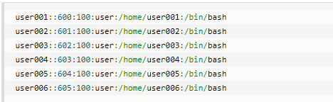

### 一、用户和用户组管理
##### Linux系统用户账号的管理
1. 添加新的用户账号
> 1. `useradd 选项 用户名`
> 2. 选项说明：
   >  + -c command:指定一段注释性描述。
   >  + -d 目录: 指定用户主目录，若目录不存在，则会自动创建。
   >  + -g 用户组：指定用户所属的用户组。
   >  + -G 用户组：用户的附加组。
   >  + -s Shell文件：指定用户的登录Shell。
   >  + -u 用户名：指定用户的用户名。
   >  + 用户名：指定新账号的登录名。
> 3. 示例
   >  + 示例1
   > \# `useradd -d /home/sam -m sam`
   > 此命令创建了一个用户sam，其中-d和-m选项用来为登录名sam产生一个主目录 /home/sam（/home为默认的用户主目录所在的父目录
   >  + 示例2
   > \# `useradd -s /bin/sh -g group -G adm,root gem`
   > 用户登录的Shell是/bin/sh，属于group组，附属组是adm和root，用户名是gem
> 4. 增加用户账号就是在/etc/passwd文件中为新用户增加一条记录，同时更新其他系统文件如/etc/shadow, /etc/group等。

2. 删除账号
> 1. `userdel 选项 用户名`
> 2. 选项：常用的选项是`-r`，作用是将用户的主目录一起删除
> 3. 示例：\#`userdel -r sam`

3. 修改账号
> 1. `usermod 选项 用户名`
> 2. 选项和useradd差不多，实质就是修改用户的属性
> 3. 示例：\#`usermod -s /bin/ksh -d /home/z -g developer sam`

4. 用户口令的管理
> 用户账号刚创建时没口令，但是被系统锁定，无法使用，只有设置了口令之后才能被使用。超级用户可以给自己和其他用户设置口令，但是普通用户只能为自己修改口令。
> 1. `passwd 选项 用户名`
> 2. 选项
   >> + -l：锁定口令，即禁用账号，使其不能登录
   >> + -u: 口令解锁
   >> + -d: 使账号无口令
   >> + -f: 强迫用户下次登录时修改口令
> 3. 如果用户名不写，则默认是修改当前用户的口令
> 4. 示例
   >> + 示例1
   >> `passwd sam`，为用户sam设置口令
   >> + 注：**普通用户为自己修改口令时，需要先输入旧的口令，但是超级用户为普通用户修改口令时，不用输入旧口令。**
   >> + 示例2
   >> `passwd -d sam`, `passwd -l sam` 禁用账号

##### 二、用户组的管理
1. 增加用户组
> 1. 语法：`groupadd 选项 用户组`
> 2. 选项：
   >> + -g GID: 指定新用户组的组标识号（GID）
   >> + -o: 一般与-g同时使用，表示新用户组的GID可以与系统已有用户组的IGD相同
> 3. 示例
   >> + 示例1
   >> `groupadd group1`，想系统中增加一个新组group1，新组的标识号在已有的最大标识号基础上加1
   >> + 示例2
   >> `groupadd -g 101 group2`，增加指定标识号的用户组
2. 删除用户组
> 1. 语法： `groupdel 用户组`, 例如：`groupdel group1`
3. 修改用户组
> 1. 语法： `groupmod 选项 用户组`
> 2. 选项：
   >> + -g GID：为用户指定新的组标识号
   >> + -o与-g同时使用
   >> + -n 新用户组：将用户组的名字改为新名字
> 3. 示例
   >> + `groupmod -g 102 group2`,标识号修改为102
   >> + `groupmod -g 1024 group2 group3`,将标识号改为1024，组名改为group3
4. 用户在多个组之间切换
> 1. 如果一个用户属于多个组，则可以在多个组之间切换
> 2. 语法：`newgrp group_name`,切换到group_name。
> 3. 注意，只能在该用户的所属组之间切换

##### 三、与用户账号有关的文件
1. /etc/passwd
> 1. 文件是用户管理中最重要的一个文件
> 2. Linux系统中每个用户号都在/etc/passwd文件中与一个对应的记录行，它记录了这个用户的一些基本属性，这个文件对所有用户都是可读的
> 3. 例如:\#`cat /etc/passwd`
   >> 
> 4. 从上面的例子我们可以看到，/etc/passwd中一行记录对应着一个用户，每行记录又被冒号(:)分隔为7个字段，其格式和具体含义如下：
`用户名:口令:用户标识号:组标识号:注释性描述:主目录:登录Shell`
   >> 1. 用户名：用户登录所用的用户名
   >> 2. 口令：加密后的用户口令。由于这个文件对所有人都是可读的，存在安全隐患，所以一般只存放一个特殊字符，如"x"或者"*"，真正加密后的口令在/etc/shadow下
   >> 3. 用户标识号。一个整数，系统内部用它来标识用户
   >> 4. 组标识号。记录用户所属的用户组
   >> 5. 注释性描述。记录着用户的一些个人情况
   >> 6. 主目录。用户的起始工作目录
   >> 7. 登录shell。表示该用户命令解释器为shell
   >> 8. 伪用户(pseudo users)。这些用户在/etc/passwd文件中占有一条记录，但是不能登录，因为它们的登录Shell为空。它们的存在主要是方便系统管理，满足相应的系统进程对文件属主的要求。
   >> 常见的伪用户和含义
      >>> bin 拥有可执行的用户命令文件。
      >>> sys 拥有系统文件。
      >>> adm 拥有帐户文件。
      >>> uucp UUCP使用。
      >>> lp lp或lpd子系统使用。
      >>> nobody NFS使用。
2. /etc/shadow
> 1. `登录名:加密口令:最后一次修改时间:最小时间间隔:最大时间间隔:警告时间:不活动时间:失效时间:标志`
> 2. 示例：`cat /etc/shadow`
   >> 
3. /etc/group
> 1. 用户组的所有信息都存放在/etc/group中
> 2. `组名:口令:组标识号:组内用户列表`
> 3. 一般组名都没有口令，所以一般为空或者为*
> 4. 例如：cat /etc/group
  >> 
4. 批量添加用户
> 1. 先编辑一个文本用户文件。每一列按照/etc/passwd密码文件的格式书写，要注意每个用户的用户名、UID、宿主目录都不能一样，密码栏可以留空或者输入x
   > 例如建一个文件users.txt，内容如下：
   >> 
> 2. 以root身份执行命令/usr/sbin/newusers，从刚创建的文件中导入数据，创建用户
   > \#`newusers < users.txt`
   > 然后查看/etc/passwd，和/home下是否增加了相应的数据或目录
> 3. 执行命令：/user/sbin/pwunconv
   > \#`pwunconv`
> 4. 编辑每个用户的密码对照文件
   > passwd.txt
   > 内容如下
   >> user001:密码
   >> user002:密码
   >> user003:密码
   >> user004:密码
> 5. 以root身份执行命令/usr/sbin/chpasswd
   > \#`chpasswd < passwd.txt`
> 6. 确认密码是否写入/etc/passwd
   > \#`pwconv`
