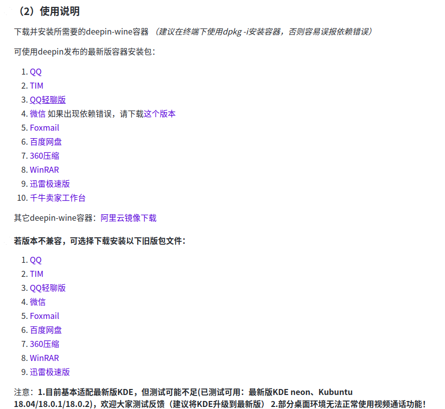
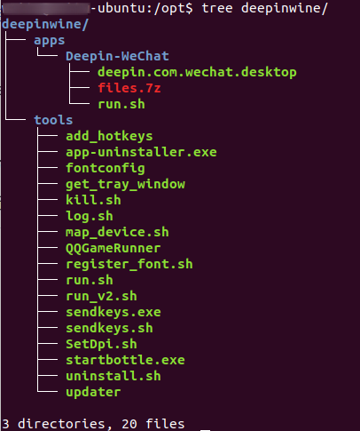
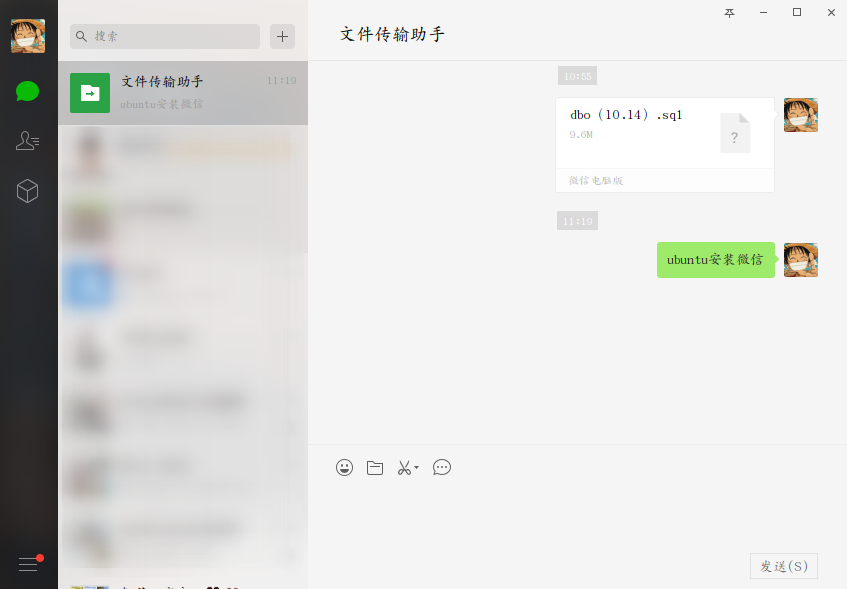

## 安装QQ/TIM/微信

2019/10/24日，腾讯发布了Linux版的QQ了，虽然功能不是很多，界面也很简单，不过想必之后会慢慢优化的，QQ for Linux去[这儿](https://im.qq.com/linuxqq/index.html)下载

下面讲的内容是以前在wine环境下安装的QQ/微信

### 1. 安装deepin-wine环境

整个项目可以去[https://github.com/wszqkzqk/deepin-wine-ubuntu](https://github.com/wszqkzqk/deepin-wine-ubuntu)这个地方看到，根目录下的README.md文件中也有介绍如何安装和使用。

简单介绍：

- 克隆github仓库(`git clone https://github.com/wszqkzqk/deepin-wine-ubuntu.git`)或者gitee仓库(`git clone https://gitee.com/wszqkzqk/deepin-wine-for-ubuntu.git`)
- 进入克隆下来的仓库目录，执行目录下的install.sh（`./install.sh`，如果该文件没有执行权限，那么就先赋予该文件执行权限，再执行`./install.sh`）。如果没有报错，那么就说明deepin-wine环境安装成功。如果报错，该仓库README.md中也有介绍。安装成功之后，会创建/opt/deepinwine/目录，此时目录下只有一个tools目录。

### 2. 安装TIM/QQ/微信

deepin-wine安装成功之后，才能进行TIM/QQ/微信的安装。

下图为仓库的README.md中介绍的使用说明。找到自己要下载的包，点击下载下来的是一个.deb文件，然后执行命令`sudo dpki -i xxxx.deb`，如果没有出错的话，你就可以在/opt/deepinwine/apps/下看到你刚才安装的程序了。

之前有人反馈安装的微信会出现依赖问题，解决办法在上图的最新版容器安装包中提供的另一个版本。

如下图是我安装微信成功后的目录和微信运行截图

