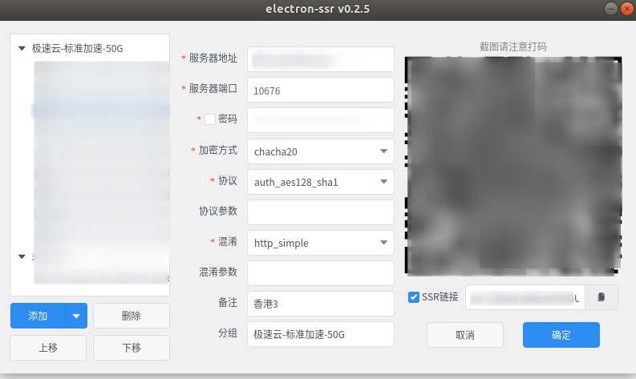
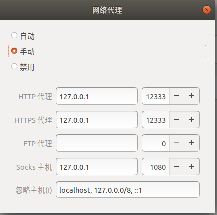

## ubuntu安装VPN客户端

此软件是从别处看到的，但是原作者好像没有再继续开发这个项目electron-ssr，我是从[https://github.com/qingshuisiyuan/electron-ssr-backup](https://github.com/qingshuisiyuan/electron-ssr-backup)这儿看到的，好东西，致敬原作者

软件安装配置好之后的截图

1. 安装依赖

   `sudo apt install libcanberra-gtk-module libcanberra-gtk3-module gconf2 gconf-service libappindicator1`

   可选依赖(如果软件报错，请安装可选依赖)：

   `sudo apt-get install libssl-dev`

   `sudo apt-get install libsodium-dev` 

2. 安装软件

   [下载electron-ssr-0.2.5.deb](./apps/electron-ssr-0.2.5.deb)

   下载完成后，进入下载的文件所在路径，执行命令安装

   `sudo dpkg -i electron-ssr-0.2.5.deb`

3. 执行命令运行软件

   `electron-ssr`

4. 在订阅管理中添加订阅地址后回车。之后就可以看到那些节点了，不过这个时候应该还不能翻墙，如果可以那就忽略下面的步骤

5. 在设置里打开网络，手动开启代理，设置相应的ip和端口之后，就可以正常上网了。

