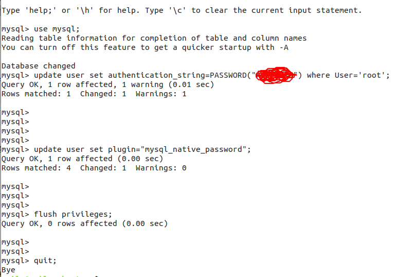

网上有很多安装的方法，我就介绍一种，使用apt安装

### 1. 安装

执行命令：`sudo apt install mysql-server`

命令执行完其实就安装好了，但是这种安装的版本是5.7的，所以如果要安装更高的版本，这种方法就不适用了。

### 2. 解决登录问题

这种安装方式，过程中并没有像Windows那样给你一个窗口，然后你还要设置用户名和密码的，这个命令执行完就安装好了，但是登录是一个问题，密码是什么呢？我们知道，数据库肯定默认是有一个root用户，但是没有密码怎么登录。

这儿我们可以设置跳过安全登录，也就是不用密码，直接使用`mysql -uroot`就可以登录了。具体操作如下

#### 2.1 停止MySQL服务

`sudo /etc/init.d/mysql stop`

#### 2.2 设置安全登录

`sudo /usr/bin/mysqld_safe --skip-grant-tables --skip-networking &`，如果这条命令报如下错误


那么执行

```sh
$ sudo mkdir -p /var/run/mysqld   # 创建目录
$ sudo chown mysql:mysql /var/run/mysqld   # 将目录的所属用户和组交给mysql
# 上面两条命令执行没问题，就再次执行下面命令
$ sudo /usr/bin/mysqld_safe  --skip-grant-tables  --skip-networking &
```

#### 2.3 修改root密码

新打开一个窗口，执行命令登录并修改密码

```mysql
# 登录
>mysql -uroot 
# 使用mysql库
>use mysql;
# 修改root密码，user是mysql库中的一张用户管理用户的表。
>update user set authentication_string=PASSWORD("新密码") where User='root';
# 最后再分别执行下面两条命令
>update user set plugin="mysql_native_password";
>flush privileges;
```



现在，重启数据库，就可以登录了

