## 目录

<!--TOC-->

* [ubuntu无法联网的问题](#ubuntu无法联网的问题)
* [提示ifconfig命令找不到](#提示ifconfig命令找不到)
* [Google浏览器的下载](#Google浏览器的下载)
* [Git下载](#Git下载)
* [Typora的安装](#Typora的安装)
* [安装QQ/TIM/微信](#安装QQ/TIM/微信)
* [安装网易云音乐](#安装网易云音乐)
* [ubuntu激活root](#ubuntu激活root)
* [桌面便签的安装](#桌面便签的安装)
* [ubuntu下画图软件kolourpaint4安装](#ubuntu下画图软件kolourpaint4安装)
* [ubuntu安装VPN客户端](#ubuntu安装VPN客户端)
* [截图工具flameshot的安装](#截图工具flameshot的安装)
* [搜狗输入法的安装](#搜狗输入法的安装)
* [Linux下krita软件的安装](#Linux下krita软件的安装)

<!--/TOC-->

## ubuntu无法联网的问题

### 1. 问题描述

> 装了Ubuntu之后，发现无法联接网络，并且在终端输入命令`ifconfig`之后，也提示找不到命令

### 2. 解决方案

> - 在你的启动盘(可能是你的u盘或者光盘)里找到pool/main/d/dkms/dkms_2.6.1-4ubuntu1_all.deb这个文件，版本号什么的可能不一样，但是目录你找到相应的目录下对应的文件就可以了。
>
> 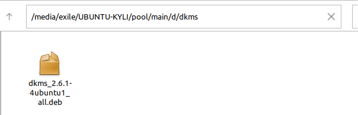
>
> 然后在该目录下执行命令：`sudo dpkg -i dkms_2.6.1-4ubuntu1_all.deb`，
>
> - 第二步。找到ubuntu-18.04-desk-amd64/pool/restricted/b/bcmwl/bcmwl-kernel-source_6.30.223.271+bdcom-0ubuntu4_amd64这个文件
>
>   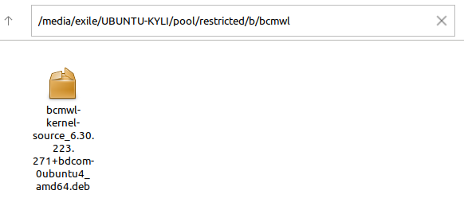
>
>   然后执行`sudo dpkg -i bcmwl-kernel-source_6.30.223.271+bdcom-0ubuntu4_amd64`这个命令。如果没有错误的话，应该就可以连接网络了。

## 提示ifconfig命令找不到

[回到目录](#目录)

### 1. 问题描述
> 在终端输入ifconfig之后，还是显示找不到命令

### 2. 解决方案
> - 第一步。更新apt-get，使用命令：`sudo apt-get update`
>
> - 第二步。使用命令：`sudo apt-get install net-tools`下载net-tools。如果过程没有报错的话，输入命令`ifconfig`就没有问题了。

## Google浏览器的下载

[回到目录](#目录)

> - 第一步。在[ubuntu chrome下载地址](http://www.ubuntuchrome.com/)中下载ubuntu chrome。下载成功后可以看到是一个.deb文件
>
> - 第二步。找到文件下载的路径，然后执行命令：`sudo dpkg -i google-chrome-stable_current_amd64.deb`，完成之后Google浏览器就下载完成了，可以在**所有程序**中找到。

## Git下载

[回到目录](#目录)

### 1. Git的安装
> - 第一步。执行命令`sudo apt-get update`。
>
> - 第二步。执行命令`sudo apt-get install git`

### 2. Git的使用
> - 第一步。执行两条命令
>
> > sudo config --global user.name "your github username"
> >
> > sudo config --global user.email "email"
>
> - 第二步。执行命令`sudo apt-key adv --keyserver keyserver.ubuntu.com --recv-keys BA300B7755AFCFAE`，得到密钥和公钥。
>
> - 第三步。复制~/.ssh/id_rsa.pub中的内容，然后在你github设置中添加.
>
>   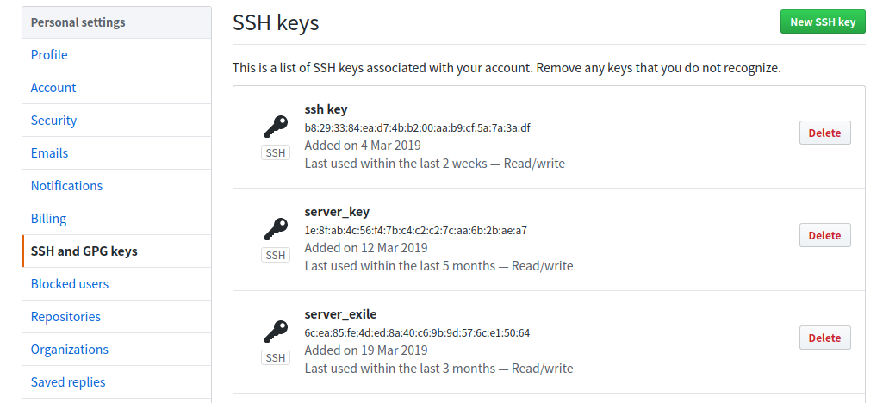
>
>   如图，点击右上角的**New SSH key**，然后将复制的公钥内容粘贴进去即可。之后就可以按照Git常规的用法去用了。

## Typora的安装

[回到目录](#目录)

### 1. 执行以下命令安装
> `sudo apt-key adv --keyserver keyserver.ubuntu.com --recv-keys BA300B7755AFCFAE`
>
> `sudo add-apt-repository 'deb https://typora.io linux/'`
>
> `sudo apt-get update`
>
> `sudo apt-get install typora`

## 安装QQ/TIM/微信

[回到目录](#目录)

### 1. 安装TIM

> - 第一步。安装deepin-wine环境。
>
> 在https://github.com/wszqkzqk/deepin-wine-ubuntu中下载zip包，我使用的是Git clone到本地
>
> 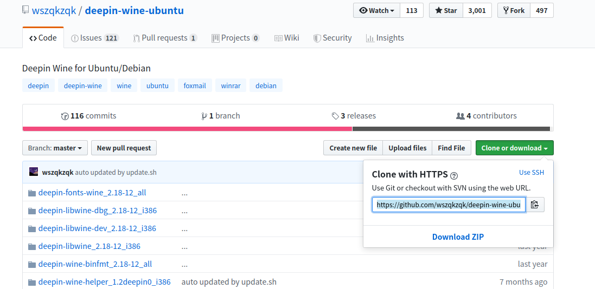
>
> 如图，复制地址之后，使用命令：`git clone https://github.com/wszqkzqk/deepin-wine-ubuntu.git`，这样就会将该项目下载到本地
>
> - 第二步。安装相关应用容器
>
>   打开网址http://mirrors.aliyun.com/deepin/pool/non-free/d/，这里面有很多的容器可以下载，如果你找不到TIM对应的容器，你也可以直接打开下面的网址，然后下载deb文件就可以了。
>
>   > - TIM：http://mirrors.aliyun.com/deepin/pool/non-free/d/deepin.com.qq.office/
>   >- QQ：http://mirrors.aliyun.com/deepin/pool/non-free/d/deepin.com.qq.im/
>   > - QQ轻聊版：http://mirrors.aliyun.com/deepin/pool/non-free/d/deepin.com.qq.im.light/
>   >- 微信：http://mirrors.aliyun.com/deepin/pool/non-free/d/deepin.com.wechat/
>   > 
>   >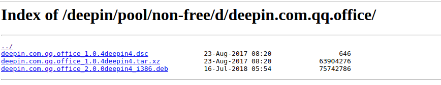

- 第三步。安装TIM

  > 进入deb文件下载路径，然后执行命令：`sudo dpkg -i xxxxx.deb`就可以了。之后就可以在所有程序中找到TIM了。
  >

### 2. 安装微信
> ubuntu安装完成后，会有一个“微信ubuntu版”，这个我试过扫码后不能登录，所以还是自己重新装一个吧
>
> - 第一步。从上面给的链接中下载微信的deb包。
>
> - 第二步。进入这个deb包所在的路径，执行命令：`sudo dpkg -i xxxxx.deb`，你也可以把这个包移动到其他目录，因为执行完这条命令之后，就会将软件安装到当前路径了。
>
> - 但是我执行过程出错了，错误信息如下图
>
>   
>
>   这是什么原因呢？因为之前我的TIM也是安装到该目录下的，我进入TIM所在的路径，发现微信竟然安装好了。如下图
>
>   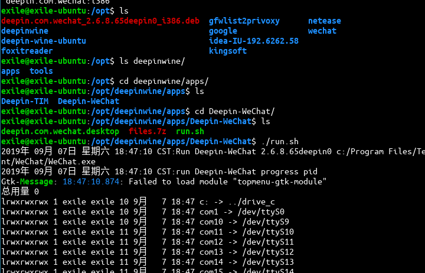
>
>   注意在/opt/deepinwine/apps/下，TIM和微信都在，所以我才如果你安装QQ的话，也会是自动安装到该目录下的。那么到底有没有安装成功呢？我去所有程序里找一下
>
>   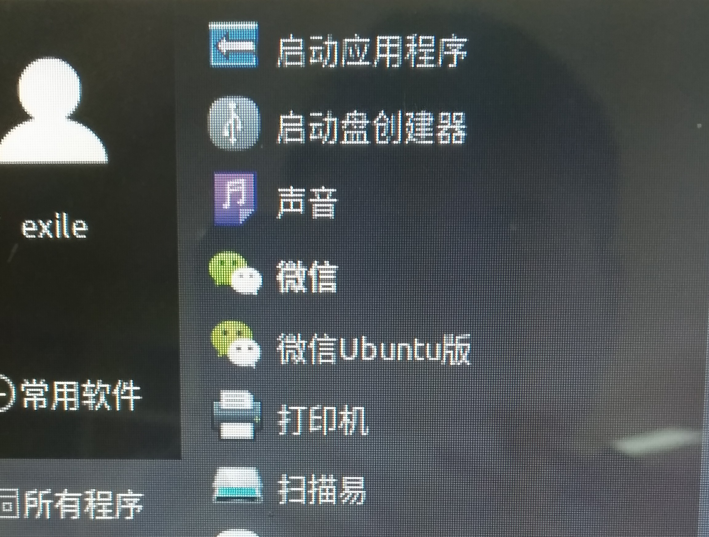
>
>   双击打开扫码，登录成功。

## 安装网易云音乐

[回到目录](#目录)

### 1. 下载网易云deb包
> 去网易云音乐的网管下载Linux的deb包。如下图
>
> 

### 2. 开始安装
> 进入deb包的路径，使用命令开始安装：`sudo dpkg -i netease-cloud-music_1.2.1_amd64_ubuntu_20190428.deb`，完成后没错误的话就是下载成功了，可在全部程序中查看

## ubuntu激活root

[回到目录](#目录)

### 1. 问题描述
> 刚装好的ubuntu的root账户是没有被激活的，但是我们依然可以使用sudo来使用一些普通用户受限的命令，但是如果现在要切换到root账户怎么办呢？

### 2. 解决方案
> 使用命令：`sudo password root`，然后会提示你为root用户创建密码，确认密码，完成后root账号就被激活了，现在可以使用命令`su`或者`su root`来切换到root账号下。

## 桌面便签的安装

[回到目录](#目录)

### 1. 应用名称
> indicator-stickynotes

### 2. 安装
> `sudo add-apt-repository ppa:umang/indicator-stickynotes`
> `sudo apt-get update `
> `sudo apt-get install indicator-stickynotes `
>
> 我看网上的教程是用上面这三条命令，但是我在使用第一条命令时出错了
>
> 
>
> 然后我索性直接跳过前两个部分，用第三个命令，但是又报错了。
>
> 然后根据提示，我使用下面命令
>
> ` sudo apt --fix-broken install indicator-stickynotes`
>
> 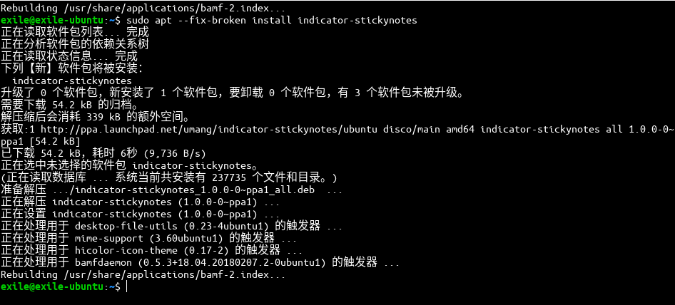
>
> 安装成功，在所有程序里可以找到。应用默认颜色是黄色，但是可以修改的。

## ubuntu下画图软件kolourpaint4安装

[回到目录](#目录)

> ubuntu自带的那些图片查看无法只能剪切，无法进行涂鸦等操作。
>
> 1. 安装命令：sudo apt-get install kolourpaint4
>
>    命令执行完就已经安装好了，可以在搜索里输入kolourpaint4找到，也可以直接在你要打开的文件上右键，就可以看到可以用kolourpaint工具打开了。
>
>    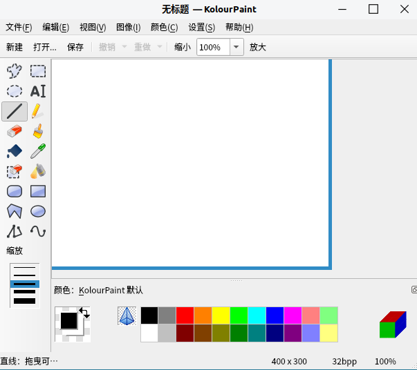

## ubuntu安装VPN客户端

[回到目录](#目录)

1. 安装依赖

   `sudo apt install libcanberra-gtk-module libcanberra-gtk3-module gconf2 gconf-service libappindicator1`

   可选依赖(如果软件报错，请安装可选依赖)：

   `sudo apt-get install libssl-dev`

   `sudo apt-get install libsodium-dev` 

2. 安装软件

   [下载electron-ssr-0.2.5.deb](./apps/electron-ssr-0.2.5.deb)

   下载完成后，进入下载的文件所在路径，执行命令安装

   `sudo dpkg -i electron-ssr-0.2.5.deb`
   
3. 执行命令运行软件

   `electron-ssr`

4. 在订阅管理中添加订阅地址后回车。之后就可以看到那些节点了，不过这个时候应该还不能翻墙，如果可以那就忽略下面的步骤

5. 在设置里打开网络，手动开启代理，设置相应的ip和端口之后，就可以正常上网了。

## 截图工具flameshot的安装

[回到目录](#目录)

1. 命令行安装该软件

   `sudo apt-get install flameshot`

2. 命令行运行

   `flameshot gui`

   执行命令就会出现一个截图窗口，如下图

   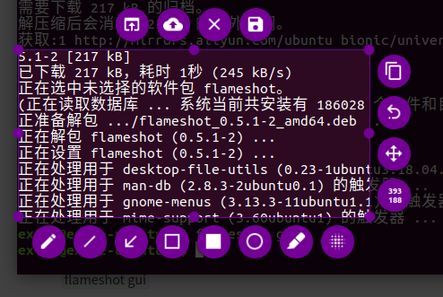

3. 当然这样每次都输入命令不方便，可以设置快捷键。在设置-设备-键盘处添加就可以了, 比如我设置的快捷键是shift+ctrl+a

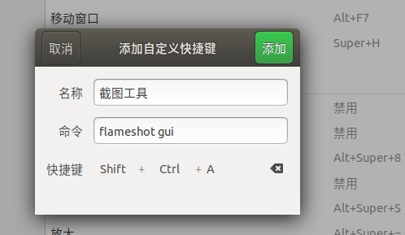

## 搜狗输入法的安装

[回到目录](#目录)

1. 安装输入框架fcitx

   `sudo apt install fcitx`

2. 到搜狗输入法的官网下载linux版的搜狗输入法

   [linux版搜狗收入法下载地址](https://pinyin.sogou.com/linux/?r=pinyin)

3. 下载得到的是一个.deb包，进入文件下载路径，执行命令

   - `sudo dpkg -i sogoupinyin_2.2.0.0108_amd64.deb`

     这个地方根据自己下载的包的版本修改命令中的包名就行了。

     不过我的出现了一点问题，如下图

     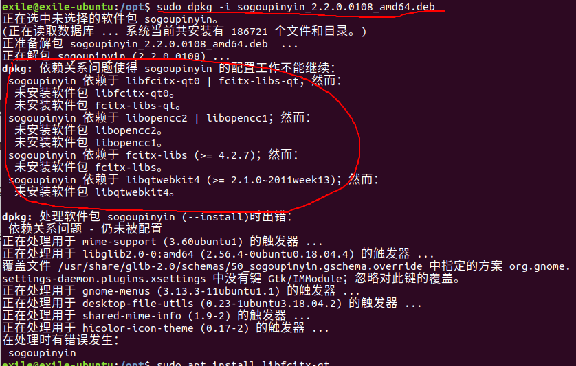

   - 然后我根据错误提示安装那些软件包，安装命令`sudo apt install 软件包名`,

     安装过程又出现了一个问题，如下，然后执行`sudo apt --fix-broken install`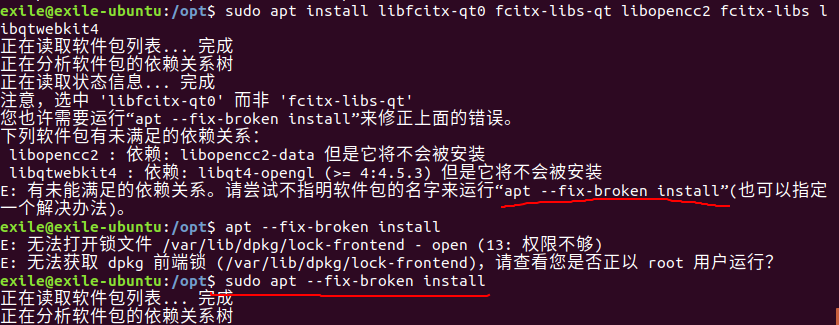

   - 完成之后，执行

     `sudo apt update`，`sudo apt upgrade`

   - 最后再次执行``sudo dpkg -i sogoupinyin_2.2.0.0108_amd64.deb``就没问题了。

   - 配置搜狗输入法
   
     键盘输入法系统选择fcitx
   
     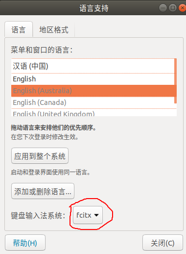
   
     最后重启就可以了。

## Linux下krita软件的安装

[回到目录](#目录)

PS在Linux系统中也可以使用，那就要使用wine环境。当然也可以安装Linux环境下的krita软件，它的功能类似于PS，如下图

1. 安装命令

   > 安装源：`sudo add-apt-repository ppa:kritalime/ppa`
   >
   > 更新：`sudo apt-get update`
   >
   > 安装Krita：`sudo apt-get install krita`
   >
   > 这样安装成功之后默认是英文的，若要使用中文版的，要安装语言包
   >
   > 使用命令安装语言包：`sudo apt-get install krita-l10n`
   >
   > 完成之后打开就软件就默认是中文的了。