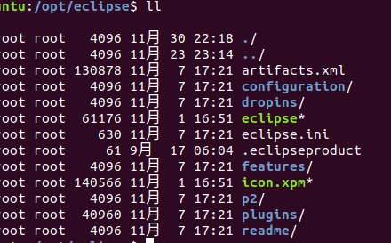

1. 假设我的eclipse放在/opt/目录下



   目录中的绿色的eclipse就是eclipse的可执行文件,icon.xpm就是图标

2. 在/usr/share/applications/目录下新建一个文件,并编辑

   `sudo vim /usr/share/applications/eclipse.desktop`

   在文件里写

   ```shell
   [Desktop Entry]
   Encoding=UTF-8
   Name=eclipse
   Comment=Eclipse IDE
   Exec="/opt/eclipse/eclipse" %U  # eclipse的可执行文件路径
   # 上面参数也可以写成Exec=/opt/eclipse/eclipse
   Icon=/opt/eclipse/icon.xpm    # 图标路径
   Terminal=false
   StarupNotify=true
   Type=Application
   Categories=Application;Development;
   ```

   保存退出,就可以在桌面应用中找到了

3. 下面来介绍一下上面这些参数的意义

   | 关键词          | 意义                                   |
   | --------------- | -------------------------------------- |
   | [Desktop Entry] | 文件头                                 |
   | Encoding        | 编码                                   |
   | Name            | 应用名称                               |
   | Name[xx]        | 不同语言的应用名称(这个参数一般用不到) |
   | Comment         | 注释                                   |
   | Exec            | 执行的命令                             |
   | Icon            | 图标路径                               |
   | Terminal        | 是否使用终端                           |
   | Type            | 启动器类型                             |
   | Categories      | 应用的类型（内容相关）                 |