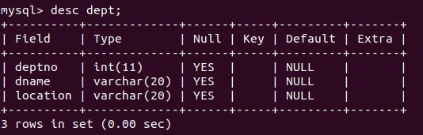
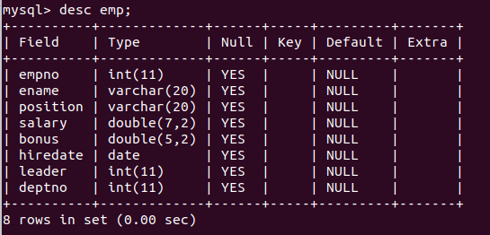
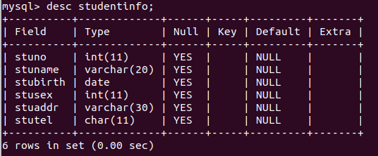
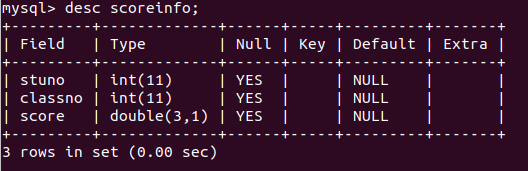
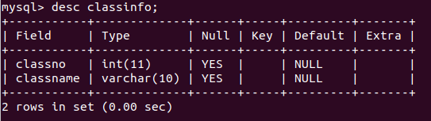

## 目录

<a href="./SQL.md" style="text-decoration:none;">MySQL基础概念</a>

<a href="./DDL.md" style="text-decoration:none;">数据定义语言</a>

<a href="./DML.md" style="text-decoration:none;">数据操纵语言</a>

<a href="./DCL.md" style="text-decoration:none;">数据管理语言</a>

<a href="./DQL.md" style="text-decoration:none;">数据查询语言</a>

<a href="./TPL.md" style="text-decoration:none;">事务处理语言</a>

<a href="./案例.md" style="text-decoration:none;">案例</a>

***注：这几篇文章中会用到的表***

1. 部门表(dept)

2. 员工表(emp)

3. 学生信息表

4. 成绩表(scoreinfo)

5. 班级表(classinfo)

