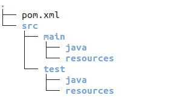

### 1. 基本概念

Maven是跨平台的项目管理工具，主要是服务于基于Java平台的项目构建，依赖管理

### 1.1 项目构建

项目构建过程包括：清理-编译-测试-打包-部署

#### 1.2 依赖管理

依赖管理指的是采用Maven来管理项目中需要的jar文件，管理方式就是"自动下载项目中需要的jar文件"，统一管理jar之间的关系。

#### 1.3 Maven的好处

目前的管理方式在开发中存在的问题。

1. 一个项目就是一个工程

   如果项目非常大，就不适合继续用package来划分业务模块，最好是每一个模块对应一个工程

2. 项目中需要的jar文件必须手动"复制粘贴"到工程的/WEB-INF/lib目录下，同样的jar文件重复出现在不同的项目工程中，让工程比较臃肿，借助Maven可以将jar文件仅仅保存在"仓库"中，在工程中引用即可。

### 2. Maven安装

下载地址：http://maven.apache.org

#### 2.1 配置Maven环境变量

#### 2.1 解压文件

将下载的.tar.gz解压到指定目录，我将它解压到/usr/local下，并将解压出来的目录重命名为maven3.6.3(这个可以不用改，我只是觉得名字太长，所以改一下)

#### 2.2 配置MAVEN_HOME和PATH

在~/.bashrc文件最后一行添加

```sh
export MAVEN_HOME=/usr/local/maven-3.6.3
export PATH=$MAVEN_HOME/bin:$PATH
```

保存后退出，执行`source ~/.bashrc`使配置生效

#### 2.3 验证是否配置成功

执行`echo $MAVEN_HOME`，`echo $PATH`看打印的结果是否正确，如果没问题的话，执行mvn -v，如果有内容打印，说明成功了。

### 3. maven使用

#### 3.1 工程的目录约定

#### 

#### 3.2 手动创建Maven工程

注意：运行Maven工程时，一定要在工程的pom.xml文件路径下

基本命令

| 命令             | 描述                                |
| ---------------- | ----------------------------------- |
| mvn clean        | 清理                                |
| mvn compile      | 编译主程序(main目录下的)            |
| mvn test-compile | 编译测试程序(test目录下的)          |
| mvn test         | 运行测试程序                        |
| mvn package      | 打包                                |
| mvn install      | 安装，即将打包后的jar包放到本地仓库 |

#### 3.3 构建过程

1. 清理：将生成的target目录删除
2. 编译：将java源程序生成class字节码文件
3. 测试：自动测试，调用junit程序(以XxxTest命名)
4. 报告：测试程序执行的结果
5. 打包：Web工程打war包，Java工程打jar包
6. 安装：Maven项目特有的概念，将jar包复制到"仓库"
7. 部署：将Web工程生成的war包复制到Tomcat的webapps中

#### 3.4 自动创建Maven工程

使用命令`mvn archetype:generate -DarchetypeCatalog=internal`自动创建工程


